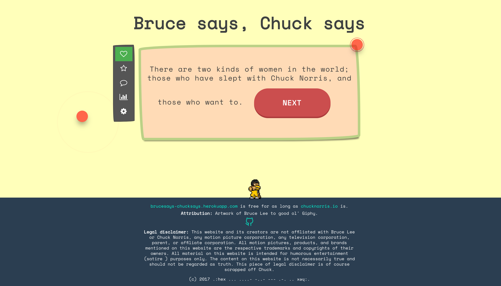

# Bruce Says, Chuck Says (draft)


[ ](https://app.codeship.com/projects/258222)

Bruce says, Chuck says is a joke screaming **waaaaatarrrh!!** interactive
chatbot.

## Description

This project demonstrates various applications of technologies with an
interactive joke telling chatbot using Chuck Norris Jokes [API][1].



Besides telling Chuck Norris jokes, it can serve as a base project for anyone
who wishes to explore in the subject of **machine learning** or to further
understand specifics of user interaction as a natural language by the process of
building, training and converting real conversation dialogs to structured data
using the algorithms/models that you've develop. This Laravel/ReactJS app is
**_built within a 5-day learning and work exploration_** and surely there are
many opportunities for improvements, suggestions or specific usecase requests,
are welcomed.

The made-up tech lingo [**`JAM-N-devilbox`**][2]stack, **N** being the graph
database Neo4J which is hosted by GrapheneDB, database as a service. Some
components were borrowed from [Trigger][3].

<table class="techtable">
    <tr>
        <th>Technology<br/>Components &<br/>Services </th>
        <th> === </th>
        <th> JAM-N-devilbox </th>
    </tr>
    <tr>
        <td>
          <ul>
            <li> Ubuntu 16.04 </li>
            <li> Nginx 1.8.1 </li>
            <li> ReactJS 16.1.1</li>
            <li> Laravel 5.5</li>
            <li> PHP 7.1 </li>
            <li> ES6 / Babel </li>
            <li> Redis 3.2.9 / Predis <b>TODO</b></li>
            <li> Neo4J / neo4j-php-client / GrapheneDB <b>TODO</b></li>
            <li> Pusher</li>
            <li> Docker </li>
          </ul>
        </td>
        <td><b> }=  <b/></td>
        <td bgcolor="#000000"></td>
    </tr>
</table>

## Milestone Summary

* Stage 0: Setup development enviroment (CD)
* Stage 1: Configure build + deployment pipelines (CI/CD)
* Stage 2: API + User Interface Design (UX/UCD)
* Stage 3: Leaderboard Features <b>TODO Redis/Graphene</b>
* Release: [Demo][4]

<TODO Deploy demo button>

## Requirements

* [Docker](https://docker.io) >= v17.09.0

**OR**

* [PHP](https://http://php.net/manual/en/install.php) >= v7.1.0
* [Yarn](https://yarnpkg.com) >= v0.2x **or** [NPM](https://www.npmjs.com/)
* [Redis](https://redis.io/download)
* [Neo4J](https://neo4j.com/download/)

## Quick Start

Make use of the convinience makefile;

```
make install
make start
```

**Or <TODO: replace development with production steps>**

Manage package managers and docker separately by doing the following;

_The two makefile commands above achieves the equivalant_

* package installation (composer, npm)
* docker composer and sync
* npm build

```
composer install
yarn install
yarn run dev

docker volume create --name=app_sync
docker-compose -f docker-compose-dev.yml up -d
docker-sync start
```

Then open http://localhost:8000 to view application.

---

To remove mounted volumes and containers.

```
make stop
```

**Or**

```
docker-sync stop
docker-compose down
```

## Testing

<b>TODO</b>

## Troubleshoot

#### ErrorException (E_ERROR) The Mix manifest does not exist.

Ensure that `./webpack.mix.js` mix is set to `react`.

```
mix.react('resource..., 'public/js')
    .sass('resource..., 'public/jcss');
```

Execute Laravel React preset which configures and scaffolds view, build to React

```
yarn add babel-preset-react -D

yarn install && yarn run dev
```

#### No implicit conversion from nil to integer (TypeError) docker-sync/watch_strategy/unison.rb:30:in `kill'

The issue with `docker-sync stop` is documented
[here #356](https://github.com/EugenMayer/docker-sync/issues/356)

## Credits

* Author of articles mentioned in some code snippets
* Graphics used/obtained from [giphy.com](https://giphy.com/),
  [flaticon.com](https://flaticon.com), [icomoon.com](https://icomoon.com) and
  the web
* Creators of [PHPDocker](https://phpdocker.io/generator),
  [Create-React-App](https://github.com/facebookincubator/create-react-app)
* Resources from [Hacknoon](https://hackernoon.com/),
  [Y.Pereira-Reis](https://ypereirareis.github.io/),
  [K.Ferguson](https://kyleferg.com)

---

[1]: https://api.chucknorris.io/#!
[2]: https://en.wikipedia.org/wiki/Solution_stack
[3]: https://github.com/daxeh/trigger
[4]: https://brucesays-chucksays.herokuapp.com/
